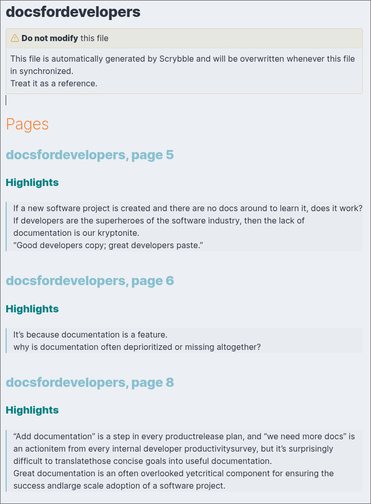
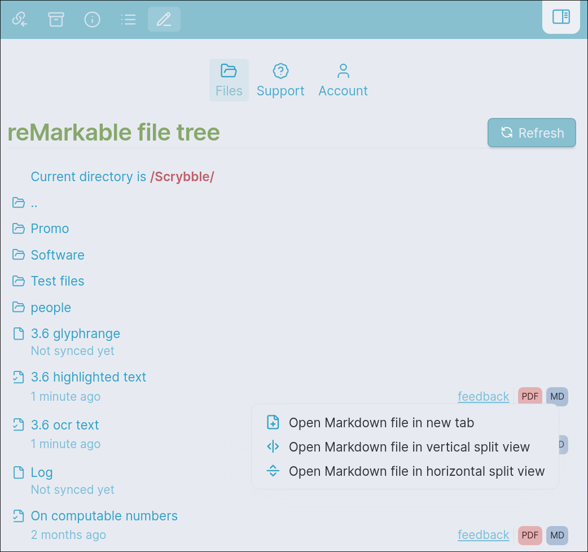

# Scrybble sync - Think analog, organize digital

Scrybble sync lets you access your handwritten notes from a [reMarkable tablet](https://remarkable.com) - a digital paper tablet for distraction-free writing and reading.

## Searchable highlights and written text

All typed text on your device, along with all the passages you highlight while reading and researching are conveniently gathered in a single Markdown file per Document.

All of these are neatly organized per page.

Perfect for people with a [Type Folio](https://remarkable.com/products/remarkable-paper/pro/type-folio)

## Your handwritten notes available for reference

Whether personal or professional, you write about things that are important for you. Make sure they're stored safely in your vault, for reference.

## Quick access to all of your ebooks, PDFs, Quick Notes and worksheets in your vault

The reMarkable is an amazing device, but it can be frustrating or worrisome that all your notes, documents, papers and eBooks are in only one place.

You can safely store them in your vault.

## Staying organized with tags

The tags you add on the reMarkable will show up in the generated Markdown documents, so it's easy to stay organized.

- Any tags added to the document itself will appear in the frontmatter
- Tags you add to specific pages will show up along the page headings

## Cost

Sync requires a subscription, costing € 22,- yearly for students and academics, or € 40,- a year for professionals.
You can also choose a monthly or two-yearly subscription.

[Get a subscription here](https://streamsoft.gumroad.com/l/remarkable-to-obsidian)

## Using Scrybble Sync

You can open the Scrybble pane in two ways, there's a small "scrybble" button in the status bar in the bottom right of Obsidian.
Or you can open it via the command pane, when you search for "Scrybble" or "reMarkable".

### Set-up

The plugin will guide you through setting up the connection with your reMarkable tablet. Once you've set-up your connection, you can authenticate with your Scrybble account and start browsing your reMarkable files right from Obsidian.

### Syncing files

Simply press a file and a sync will be requested. Once it's ready, it will appear in your vault.
Within the reMarkable file tree, you can easily access the associated PDF or Markdown file for your synced reMarkable notebook by clicking the respective MD or PDF button.

### Settings

By default, notes will be synced to the "scrybble" folder, you can change this if you wish.

## Open-source

All of Scrybble is entirely open source, you can find the source-code for the various components on the [**scrybbling together** Github](https://github.com/Scrybbling-together/).

## Links

- [scrybble.ink](https://scrybble.ink)
- Support: 
  - mail@scrybble.ink
  - [Scrybbling together - The community Discord](https://discord.gg/zPrAUzNuSN)
